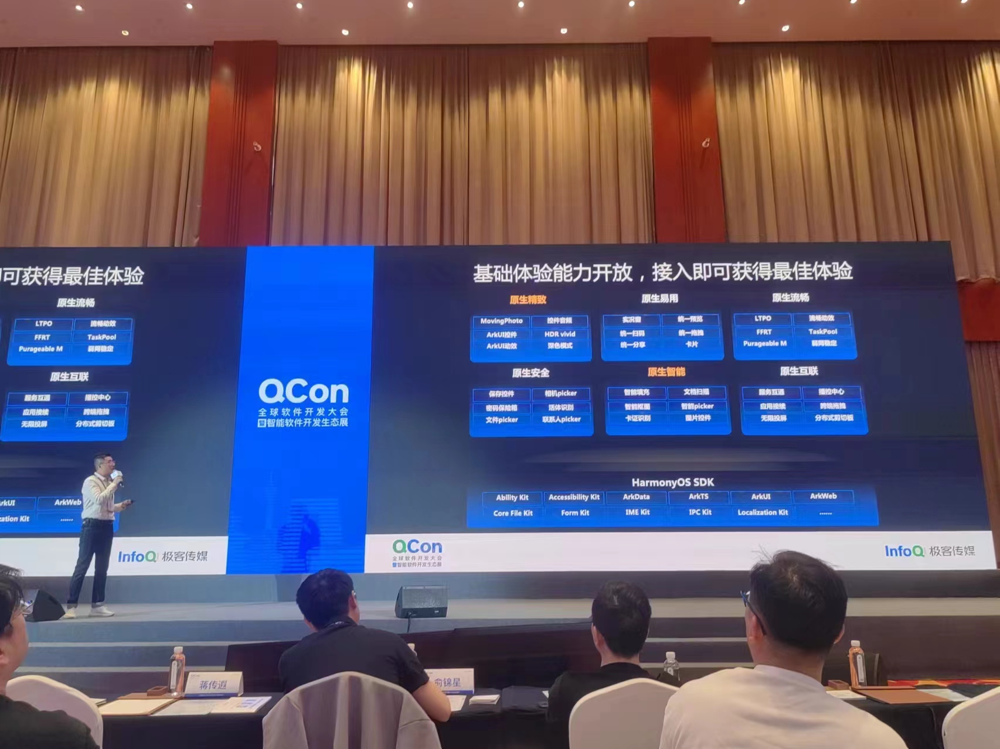
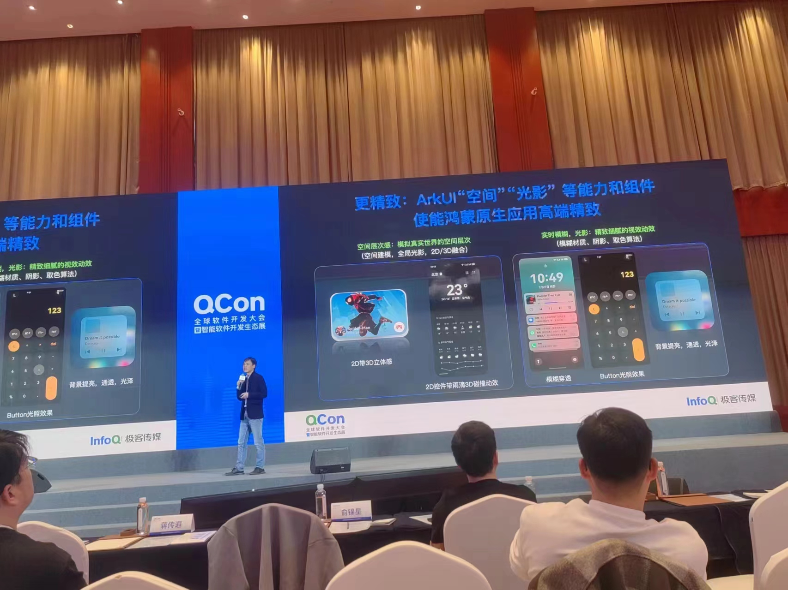

# 鸿蒙六大原生

这篇文章我们来探讨一下HarmonyOS的六大原生

- 原生精致
- 原生易用
- 原生流畅
- 原生安全
- 原生智能
- 原生互联

## 原生精致

HarmonyOS原生精致指的是HarmonyOS原生的UI组件能够提供完美的UI功能，方便的开发出美观，精致的程序。

ArkUI能够提供完美的一多特性，在不同的屏幕下下能够提供快速适配的能力，比如不同分辨率下的无损缩放，不同屏幕上的色彩适配，能够保证ArkUI组件构成的UI的精致性。同时HarmonyOS能够提供丰富的,实用的UI能力比如模糊，2D/3D融合。

原生精致只是一个概念，未来HarmonyOS会围绕原生精致，开放更多易用的API，为开发者提供更好的开发体验，能够更方便地开发出更好的产品。

## 原生易用

HarmonyOS原生精致指的是HarmonyOS以ArkTS作为基础编程语言，简单易上手，提供以开发者为核心，易用的API。

## 原生流畅

## 原生智能

## 原生安全

## 原生互联